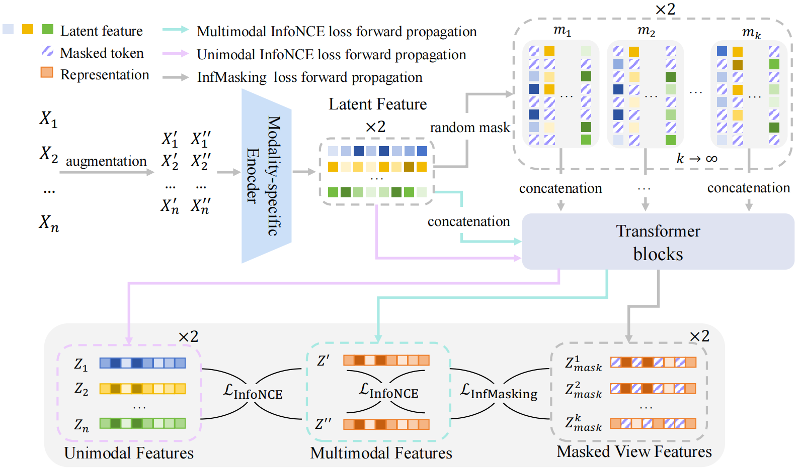

# InfMasking: Unleashing Synergistic Information  by Contrastive Multimodal Interactions

This repository contains the code for the paper "InfMasking: Unleashing Synergistic Information by Contrastive Multimodal Interactions"(NeurIPS 2025)🎉🎉🎉. 

If you find this repository useful for your research, please consider citing us: 

```bibtex
@inproceedings{wen2025infmasking,
title={InfMasking: Unleashing Synergistic Information by Contrastive Multimodal Interactions},
author={Liangjian Wen and Qun Dai and Jianzhuang Liu and Jiangtao Zheng and Yong Dai and Dongkai Wang and Zhao Kang and Jun Wang and Zenglin Xu and Jiang Duan},
booktitle={The Thirty-ninth Annual Conference on Neural Information Processing Systems},
year={2025}
}
```

## Overview

**Abstract:** In multimodal representation learning, synergistic interactions between modalities not only provide complementary information but also create unique outcomes through specific interaction patterns that no single modality could achieve alone. Existing methods may struggle to effectively capture the full spectrum of synergistic information, leading to suboptimal performance in tasks where such interactions are critical. This is particularly problematic because synergistic information constitutes the fundamental value proposition of multimodal representation. To address this challenge, we introduce InfMasking, a contrastive synergistic information extraction method designed to enhance synergistic information through an Infinite Masking strategy. InfMasking stochastically occludes most features from each modality during fusion, preserving only partial information to create representations with varied synergistic patterns. Unmasked fused representations are then aligned with masked ones through mutual information maximization to encode comprehensive synergistic information. This infinite masking strategy enables capturing richer interactions by exposing the model to diverse partial modality combinations during training. As computing mutual information estimates with infinite masking is computationally prohibitive, we derive an InfMasking loss to approximate this calculation. Through controlled experiments, we demonstrate that InfMasking effectively enhances synergistic information between modalities. In evaluations on large-scale real-world datasets, InfMasking achieves state-of-the-art performance across seven benchmarks.

<div align="center">
  
</div>

Paper link: "[InfMasking: Unleashing Synergistic Information by Contrastive Multimodal Interactions](https://arxiv.org/abs/2509.25270)".

## Training and Evaluation

### Installation 

Please create a conda environment with python 3.8 and install the required packages after the code is cloned.

```bash
conda env create -f environment.yml
conda activate multimodal
cd InfMasking
```

###  Synthetic Experiments on Trifeature Datasets

To run the synthetic experiments on Trifeature datasets, please execute the following command:

```bash
bash run_scripts/trifeatures_run.sh
```

To evaluate the learned representations, please execute the following command. Please change the dataset and specific-dataset parameters in `run_scripts/test.sh` before running the command.

```bash
bash run_scripts/test.sh
```
The evaluation of below models is supported in `run_scripts/test.sh`.

#### Results

We select "Cross", "Cross+Self", FactorCL, MAE and CoMM as baselines for comparison. 
Linear probing accuracy (in \%) of redundancy (shape), uniqueness (texture) and synergy (color and texture) on Trifeature dataset is shown in the table below.

| Model | redundancy↑ | uniqueness↑ | synergy↑ |
| --- | --- | --- | --- |
| $\text{Cross}^\clubsuit$ | **$100.0$** | $11.6$ | $50.0$ |
| $\text{Cross+Self}^\clubsuit$  | $99.7$ | $86.9$ | $50.0$ |
| $\text{FactorCL}^\clubsuit$ | $99.8$ | $62.5$ | $46.5$ |
| $\text{MAE}$ | $99.8_{\pm0.11}$ | $82.4_{\pm3.09}$ | $50.1_{\pm0.24}$ |
| $\text{CoMM}$ | $99.9_{\pm0.06}$ | $86.8_{\pm2.99}$ | $71.4_{\pm3.47}$ |
| $\text{InfMasking (ours)}$ | $99.9_{\pm0.09}$ | **$90.6_{\pm2.31}$** | **$77.0_{\pm4.22}$** |

$^\clubsuit$ Results are taken from the paper "[What to align in multimodal contrastive learning ?](https://arxiv.org/abs/2409.07402)". 


### Experiments with 2 Modalities on Multibench

To run the experiments with 2 modalities on Multibench, please execute the following command:

```bash
bash run_scripts/multibench_run.sh
```

#### Results
Linear probing MSE($\times 10^{-4}$) for regression task and top-1 accuracy (in \%) for classification tasks on Multibench is shown in the table below.


| Model | Regression<br>V&TEE↓ | MIMIC↑ | MOSI↑ | UR-FUNNY↑ | MUSTARD↑ | Classification<br>Average\* ↑ |
| --- | --- | --- | --- | --- | --- | --- |
| $\text{Cross}^\clubsuit$  | $33.09_{\pm3.67}$ | $66.7_{\pm0.1}$ | $47.8_{\pm1.8}$ | $50.1_{\pm1.9}$ | $53.5_{\pm2.9}$ | $54.52$ |
| $\text{Cross+Self}^\clubsuit$  | $7.56_{\pm0.31}$ | $65.49_{\pm0.0}$ | $49.0_{\pm1.1}$ | $59.9_{\pm0.9}$ | $53.9_{\pm4.0}$ | $57.07$ |
| $\text{FactorCL}^\clubsuit$  | $10.82_{\pm0.56}$ | $67.3_{\pm0.0}$ | $51.2_{\pm1.6}$ | $60.5_{\pm0.8}$ | $55.80_{\pm0.9}$ | $58.7$ |
| $\text{CoMM}$  | $7.96_{\pm2.13}$ | $66.4_{\pm0.41}$ | $63.7_{\pm2.5}$ | $63.3_{\pm0.51}$ | $64.4_{\pm1.1}$ | $64.45$ |
| $\text{InfMasking (ours)}$ | **$4.23_{\pm0.37}$** | **$68.1_{\pm0.42}$** | **$69.0_{\pm1.2}$** | **$64.3_{\pm0.9}$** | **$66.8_{\pm2.5}$** | **$67.05$** |

$^\clubsuit$ Results are taken from the paper "[What to align in multimodal contrastive learning ?](https://arxiv.org/abs/2409.07402)". 

### Experiments with 3 Modalities on Multibench

To run the experiments with 3 modalities on Multibench, please execute the following command:

```bash
bash run_scripts/all-mod_run.sh
```

#### Results

Linear probing top-1 accuracy (in \%) for classification tasks on Vision\&Touch and UR-FUNNY datasets with 3 modalities on Multibench is shown in the table below.

| Model         | #Mod. | V&T CP↑       | UR-FUNNY↑      |
|---------------|-------|---------------|----------------|
| $\text{Cross}$         | 2     | $86.3_{\pm0.25}$ | $50.1^\clubsuit$ |
| $\text{Cross+Self}$    | 2     | $87.6_{\pm0.26}$ | $59.9^\clubsuit$ |
| $\text{CoMM}$          | 2     | $87.0_{\pm1.77}$ | $63.3_{\pm0.51}$  |
| $\text{InfMasking (ours)}$ | 2     | $88.5_{\pm0.33}$ | $64.3_{\pm0.9}$   |
| $\text{CMC}^\clubsuit$ | 3     | $94.1$          | $59.2$           |
| $\text{CoMM}$          | 3     | **$94.1_{\pm0.17}$** | $64.8_{\pm1.13}$  |
| $\text{InfMasking (ours)}$ | 3     | $94.1_{\pm0.09}$ | **$65.6_{\pm1.15}$**  |

$^\clubsuit$ Results are taken from the paper "[What to align in multimodal contrastive learning ?](https://arxiv.org/abs/2409.07402)".

###  Experiments with 2 Modalities on Multimodal IMDb 

To run the experiments with 2 modalities on Multimodal IMDb, please execute the following command:

```bash
bash run_scripts/MM_IMDb_run.sh
```

#### Results

Linear probing F1-score (weighted and macro) (in \%) for MM-IMDB is shown in the table below.

| Model                        | Modalities | weighted-f1↑   | macro-f1↑      |
|------------------------------|------------|----------------|----------------|
| $\text{SimCLR}^{\clubsuit\triangle}$  | V          | $40.35_{\pm0.23}$ | $27.99_{\pm0.33}$ |
|                              | V          | $51.5$           | $40.8$           |
| $\text{CLIP}^\clubsuit$      | L          | $51.0$           | $43.0 $          |
|                              | V+L        | $58.9_{\pm0.0}$ | $50.9_{\pm0.0}$ |
| $\text{SLIP}^{\clubsuit\triangle}$  | V+L        | $56.54_{\pm0.19}$ | $47.35_{\pm0.27}$ |
| $\text{CLIP}^{\clubsuit\triangle}$  | V+L        | $54.49_{\pm0.19}$ | $44.94_{\pm0.30}$ |
| $\text{CoMM}_{\text{(CLIP backbone)}}$   | V+L        | $61.29_{\pm0.73}$ | $53.79_{\pm0.22}$ |
| $\text{InfMasking}_{\text{(ours, CLIP backbone)}}$ | V+L | **$62.60_{\pm0.26}$** | **$55.93_{\pm0.19}$** |


$^\triangle$ indicates further training on unlabeded data. $^\clubsuit$ Results are taken from the paper "[What to align in multimodal contrastive learning ?](https://arxiv.org/abs/2409.07402)".

## Thanks
We sincerely thank the contributors of the following repositories, which have been instrumental in our implementation:
- [What to align in multimodal contrastive learning ?](https://github.com/Duplums/CoMM)
- [Masked Autoencoders Are Scalable Vision Learners](https://github.com/facebookresearch/mae)


